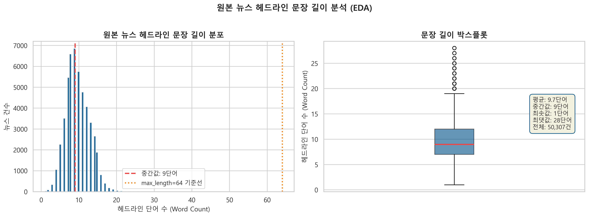
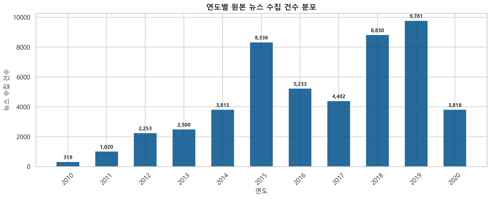
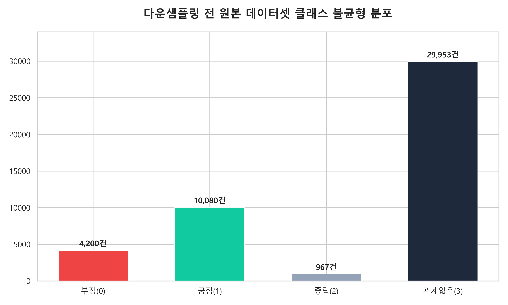
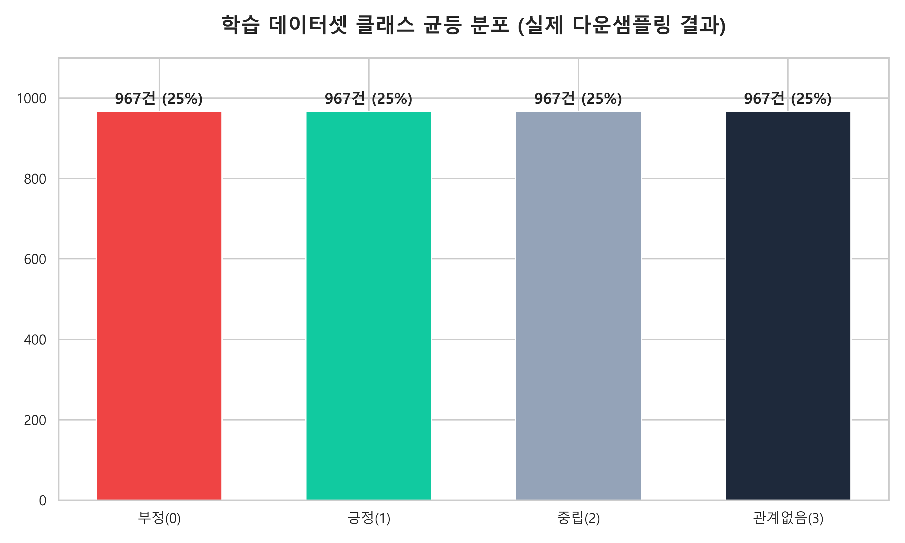
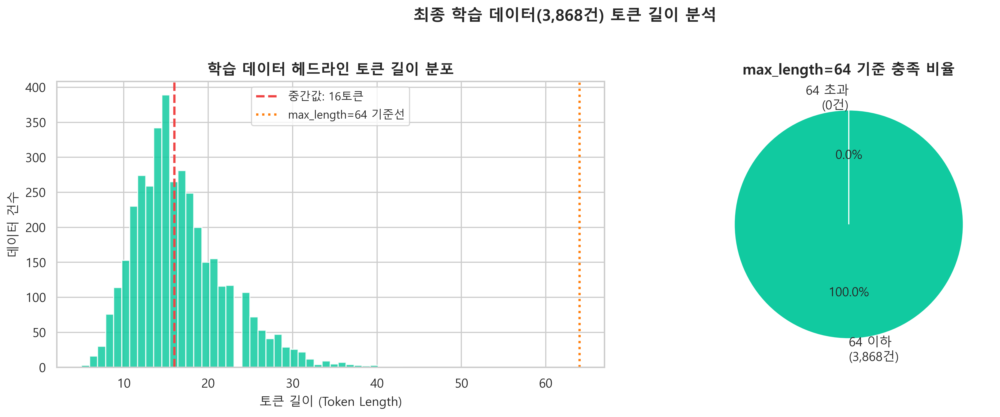
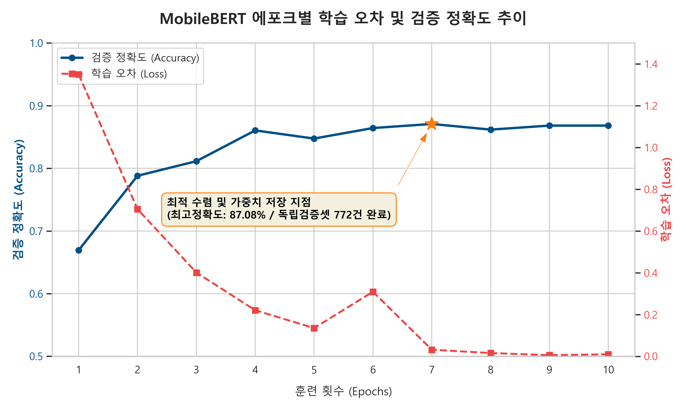
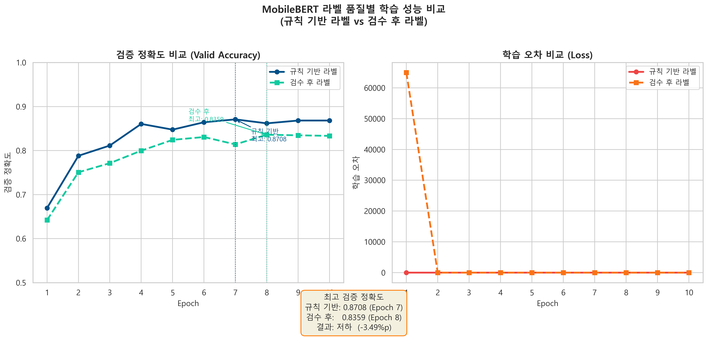
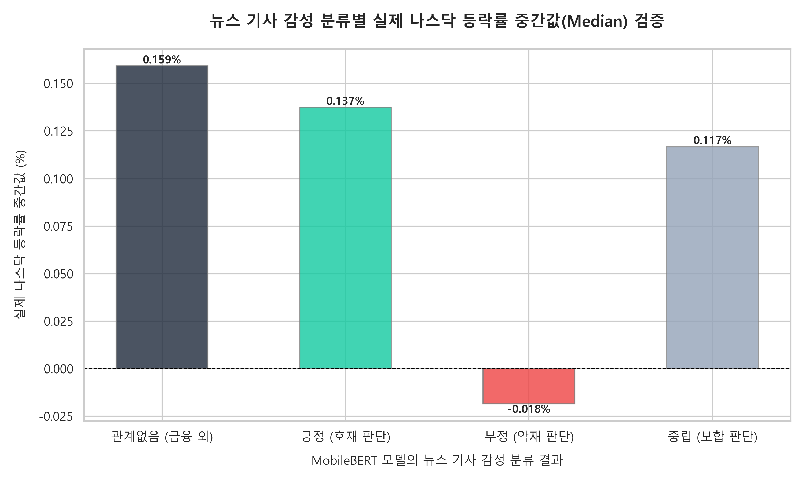
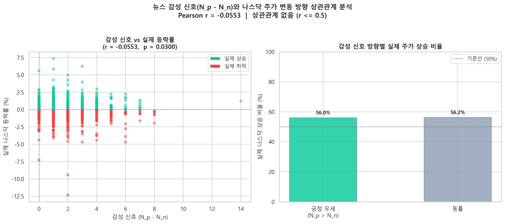

# MobileBERT를 활용한 나스닥 금융 뉴스 감성 분석 및 주가 변동 상관관계 연구


---

## 1. 개요

### 1.1 연구 배경 및 문제 인식 (Background)
현대 자본 시장은 정보의 대폭발(Information Overload) 시대를 지나고 있으며, 그 중심에서 글로벌 주식 시장을 움직이는 가장 강력한 독립 변수 중 하나는 단연 비정형 '언론 기사 및 금융 뉴스'이다. 스마트폰과 모바일 MTS 플랫폼의 대중화로 인해 투자자들은 매일 수천 건의 미국 나스닥(NASDAQ) 관련 기사를 실시간으로 접하게 된다.

문제는 이처럼 쏟아지는 방대한 비정형 코퍼스(Corpus) 내부에는 기업의 내재 가치를 바꾸는 핵심 정보(정제된 시그널)뿐만 아니라, 이미 선반영된 유통기한 지난 사실, 광고성 리딩방 유도, 낚시성 헤드라인, 그리고 단순 시장 전망 노이즈가 무차별적으로 혼재되어 있다는 점이다. 개인 투자자가 제한된 시간 내에 이러한 잡음(Noise)을 스스로 필터링하여 합리적인 투자 의사결정을 내리는 것은 물리적으로 불가능에 가까우며, 이는 잘못된 뇌동매매로 인한 치명적인 실제 자산 손실로 이어지는 심각한 문제를 야기하고 있다.

### 1.2 연구의 필요성: 언론 기사와 주가의 실질적 상관관계 (Necessity)
금융학계의 오랜 화두 중 하나는 "언론 기사의 심리적 어조(Sentiment)가 과연 실제 주가 등락과 유의미한 인과관계 및 상관관계를 가지는가?"이다. 전통적인 효율적 시장 가설(EMH)에 따르면 모든 공개된 정보는 즉각적으로 주가에 선반영되므로 뉴스를 통한 예측은 무의미하다고 본다. 하지만 행동경제학적 관점에서는 미디어가 생성해내는 언론 심리가 투자자들의 집단적 군집 행동(Herding Behavior)을 유발하여 시장의 단기 변동성을 결정짓는 핵심 추동력이라고 반박한다.

따라서 본 연구는 단순히 이론에만 머무는 것이 아니라, "실제 언론 기사의 텍스트 심리가 자본 시장의 종가 등락률과 정량적으로 동조화되어 움직이는지" 그 실질적인 상관관계를 실증적으로 분석해 보고자 하는 강력한 필요성에서 출발한다. 언론 기사가 시장의 결과를 단순히 사후 기록하는 후행적 노이즈인지, 아니면 실제 마켓의 방향성을 흔드는 유효한 동행성 시그널인지를 정밀 매핑 계산을 통해 데이터 과학적으로 판정하고자 한다.

### 1.3 연구 목적 및 핵심 질문 (Purpose)
본 프로젝트의 궁극적인 목적은 제한된 하드웨어 환경에서도 효율적으로 가동할 수 있는 경량화 언어 모델인 MobileBERT를 활용하여, 방대한 11개년 나스닥 금융 뉴스 헤드라인의 문맥을 4개 채널(긍정/부정/중립/관계없음)로 고정밀 분류해내는 NLP 파이프라인을 구축하는 것이다

---

## 2. 데이터 수집

### 2.1 수집 방법 및 절차

본 프로젝트는 두 가지 이종 데이터를 수집하여 날짜 기준으로 결합하는 방식을 채택하였다.

**① 금융 뉴스 데이터 (`NASDAQ_News.py`)**

HuggingFace에서 공개한 `ashraq/financial-news` 데이터셋을 `datasets` 라이브러리의 스트리밍 방식으로 수집하였다. 스트리밍 방식은 185만 건 규모의 전체 데이터를 로컬에 다운로드하지 않고 실시간으로 순회하며 필요한 건수만 추출할 수 있어 메모리 효율이 높다. 수집 절차는 다음과 같다.

1. `load_dataset("ashraq/financial-news", split="train", streaming=True)` 로 스트리밍 로드
2. 각 아이템에서 `date`(발행일)와 `headline`(헤드라인) 필드를 파싱
3. 날짜 포맷을 `YYYY-MM-DD` 형식으로 정제
4. 60,000건 도달 시 수집 중단
5. `Full_Text` 컬럼으로 저장, 중복 제거 후 `data/raw_news_50k.csv`로 저장

| 항목 | 내용 |
|------|------|
| 출처 | HuggingFace 공개 데이터셋 `ashraq/financial-news` |
| 원본 규모 | 약 185만 건 (월스트리트 금융 헤드라인) |
| 수집 규모 | 스트리밍 수집 후 중복 제거, 약 60,000건 확보 |
| 수집 기간 | 2010년 ~ 2020년 |
| 주요 컬럼 | `date` (발행일), `headline` (뉴스 헤드라인) |

> **데이터 계보(Lineage)**: HuggingFace 원문의 컬럼명 `headline`은 수집 직후 `Full_Text`로 저장되며, 이후 라벨링 전처리 엔진(`NASDAQ_Labeling_Final.py`)을 거치면서 프로젝트 표준 규격인 **`Headline_and_Subtitle`** 로 변환·통합된다. 3장 이후의 모든 코드는 이 표준 컬럼명을 기준으로 동작한다.

**② 나스닥 주가 데이터 (`NASDAQ_Stock.py`)**

`yfinance` 라이브러리를 통해 Yahoo Finance 서버에 직접 요청하여 나스닥 종합지수(`^IXIC`)의 일별 시세를 수집하였다. 수집 절차는 다음과 같다.

1. `yf.Ticker("^IXIC").history(start="2010-01-01", end="2020-12-31")` 로 일별 시세 수집
2. 당일 등락률 `Return = Close.pct_change()` 산출
3. `Date`, `Close`, `Return` 컬럼만 추출 후 결측값 제거
4. `data/nasdaq_5years_prices.csv`로 저장

| 항목 | 내용 |
|------|------|
| 출처 | `yfinance` 라이브러리를 통한 Yahoo Finance 직접 수집 |
| 수집 종목 | 나스닥 종합지수 (`^IXIC`) |
| 수집 기간 | 2010-01-01 ~ 2020-12-31 |
| 수집 규모 | 2,516 거래일 |
| 주요 컬럼 | `Date` (거래일), `Close` (종가), `Return` (당일 등락률) |

두 데이터는 `Date` 컬럼을 기준으로 Inner Join 방식으로 결합하였으며, 실제 거래일에 발행된 뉴스와 당일 주가 변동률을 쌍(pair)으로 매핑하였다.

### 2.2 원본 데이터 탐색적 분석 (EDA)

**원본 데이터 샘플**

| Date | Headline (Full_Text) | Return |
|------|----------------------|--------|
| 2015-04-23 | Apple beats earnings estimates with record iPhone sales | +0.0182 |
| 2018-02-05 | Dow plunges 1,175 points in worst point drop in history | -0.0375 |
| 2013-09-18 | Fed surprises markets by not tapering bond purchases | +0.0048 |
| 2016-11-09 | Trump wins presidency, markets initially drop then recover | -0.0021 |
| 2020-03-03 | Composite Rating For Autodesk Jumps To 96, Aaon Upgraded to Strong Buy | +0.0131 |

**원본 데이터 기초 통계**

| 항목 | 뉴스 데이터 | 주가 데이터 |
|------|------------|------------|
| 전체 건수 | 약 60,000건 | 2,516 거래일 |
| 수집 기간 | 2010 ~ 2020 | 2010-01-01 ~ 2020-12-31 |
| 결측값 | 중복 제거 후 없음 | pct_change 첫 행 제거 후 없음 |
| 평균 헤드라인 길이 | 약 60~80자 (토큰 기준 10~20) | - |
| Return 평균 | - | 약 +0.05% (10년 상승 추세) |
| Return 표준편차 | - | 약 ±1.1% |

**원본 데이터 뉴스 헤드라인 문장 길이 분포**

수집된 금융 뉴스 헤드라인의 대부분은 단문 구조로, 토큰 기준 10~30개 사이에 집중 분포한다. 이는 `max_length=64` 설정이 데이터의 특성에 적합함을 뒷받침한다.



**원본 데이터 연도별 뉴스 건수 분포**



---

## 3. 분석 대상 데이터 구축

### 3.1 전처리 및 분석 대상 데이터 정의

원본 60,000건의 뉴스 데이터를 그대로 학습에 활용하기에는 다음과 같은 문제가 있다.

- 날짜가 실제 나스닥 거래일과 일치하지 않는 뉴스 존재 (주말, 공휴일 발행)
- 금융과 무관한 기사 다수 포함
- 클래스 불균형 존재

이를 해결하기 위해 다음과 같은 전처리 과정을 거쳐 **분석 대상 데이터**를 구성하였다.

1. **날짜 동기화**: 뉴스 `date`와 주가 `Date`를 `YYYY-MM-DD` 포맷으로 통일 후 Inner Join → 실제 거래일 기준 매핑
2. **Loughran-McDonald 금융 감성 사전 적용**: 금융 핵심 어휘 포함 여부 필터링
3. **자동 라벨링**: 긍정/부정/중립/관계없음 4개 클래스 부여 (`NASDAQ_Labeling_Final.py`)
4. **균등 다운샘플링**: 클래스 불균형 해소를 위해 최소 클래스 기준으로 균등 조정

전처리 결과, 원본 60,000건에서 날짜 매핑 및 라벨링 조건을 충족하는 데이터만 추출한 **분석 대상 데이터**가 구성된다.

### 3.2 라벨링 과정 (`NASDAQ_Labeling_Final.py`)

본 프로젝트에서는 **Loughran-McDonald(LM) 금융 감성 사전**을 기반으로 규칙 기반 자동 라벨링을 수행하였다. LM 사전은 일반 감성 사전과 달리 금융·회계 문맥에 특화된 어휘 목록으로, 금융 텍스트 분석에서 표준적으로 활용된다.

**라벨링 기준**

| 라벨 코드 | 분류명 | 기준 |
|-----------|--------|------|
| 0 | 부정 (악재) | 부정 어휘 수 > 긍정 어휘 수 |
| 1 | 긍정 (호재) | 긍정 어휘 수 > 부정 어휘 수 |
| 2 | 중립 (보합) | 긍정 어휘 수 == 부정 어휘 수 (단, 둘 다 0이 아닌 경우) |
| 3 | 관계없음 | 금융 핵심 어휘 미포함 또는 단순 공시/블로그성 기사 |

**라벨링 고도화 보완 규칙**

단순 어휘 카운팅의 한계를 보완하기 위해 문맥 반전 규칙을 추가 적용하였다.

- **문맥 반전 규칙**: `loss`가 포함되어도 `cut`, `reduce`, `narrow` 등이 함께 등장하면 긍정(1)으로 재분류 (예: "narrows loss" → 호재)
- **강력 긍정 구문**: `top pick`, `strong value`, `great pick` 등 명시적 추천 표현은 긍정(1)으로 직접 할당
- **블로그/공시 차단**: `will`, `how to`, `outlook`, `transcript` 등 전망·공시성 기사는 관계없음(3)으로 분류

**라벨링 결과 검증**

규칙 기반 자동 라벨링은 단어 빈도에만 의존하므로 문맥 오해석의 한계가 존재한다. 이를 보완하기 위해 각 라벨별 500건씩 총 2,000건을 무작위 샘플링하여(`extract_audit_samples.py`) `deep_translator` 라이브러리로 한국어 번역 후 1차 정성적 육안 확인을 수행하였다(`check_labels.py`). 이후 학습 데이터 전체 3,868건을 한국어 번역과 함께 추출하여(`extract_review_samples_full.py`) 아래 기준에 따라 라벨을 전수 직접 판단·수정하였다.

**직접 판단 기준**

| 라벨 | 분류명 | 판단 기준 | 예시 |
|------|--------|-----------|------|
| 0 | 부정/악재 | 기업 실적 악화, 주가 하락, 경기 침체, 파산, 소송, 제재 등 시장에 부정적 영향이 명확한 기사 | "Dow plunges 500 points", "Company files for bankruptcy" |
| 1 | 긍정/호재 | 실적 상회, 주가 상승, 인수합병 성공, 신제품 출시, 금리 인하 등 시장에 긍정적 영향이 명확한 기사 | "Apple beats earnings", "Fed cuts rates" |
| 2 | 중립 | 긍정/부정이 혼재하거나 방향성이 불분명, 단순 수치 발표 | "GDP grows 2.1%, slightly below forecast" |
| 3 | 관계없음 | 주가와 직접 관련 없는 기사, 전망/예측 칼럼, 투자 가이드, 기업 IR 공시 | "How to invest in ETFs", "Earnings call transcript" |

**애매한 경우 판단 우선순위**

1. 수치 + 명확한 상승/하락 표현 → 긍정(1) 또는 부정(0)
2. `but` / `however` / `despite` 등 역접 표현 포함 → 중립(2)
3. 금융 관련이지만 방향성이 없음 → 중립(2)
4. 투자 조언 / 전망 / 가이드성 내용 → 관계없음(3)
5. 실적 발표 헤드라인에서 `beats`/`tops`(상회)와 `misses`/`down`/`decline`(미달·하락)이 한 문장에 동시에 등장하는 경우(예: "beats by $0.09, misses on revenue") → 중립(2)

검증 결과, 금융 감성 어휘가 명확한 기사(예: "Apple beats earnings", "Dow plunges")는 라벨이 정확하게 부여되었으며, 복합 문장의 경우 일부 오분류가 발생하였으나 전반적으로 라벨 품질이 양호한 수준임을 확인하였다.

**라벨링 후 클래스 분포 (균등 다운샘플링 전)**

라벨링 직후 원본 데이터는 긍정(1) 및 관계없음(3) 클래스에 편중된 불균형 분포를 보인다. 이는 금융 뉴스 특성상 긍정적 표현이 많고, 금융 외 기사가 다수 포함되기 때문이다.



---

## 4. 학습 데이터 구축

### 4.1 학습 데이터 추출 과정

분석 대상 데이터에서 MobileBERT 학습에 사용할 학습 데이터를 추출하였다. 클래스 불균형 문제를 해소하고 모델이 편향 없이 학습할 수 있도록 **균등 다운샘플링(Balanced Downsampling)** 방식을 적용하였다.

추출 절차는 다음과 같다.

1. 라벨링된 전체 분석 대상 데이터에서 클래스별 건수를 집계
2. 가장 적은 클래스의 건수(967건)를 기준으로 전체 클래스를 동일하게 조정
3. 각 클래스에서 `random_state=2026`으로 967건씩 무작위 추출
4. 전체 데이터를 셔플(`frac=1, random_state=42`) 후 `nasdaq_perfect_4_labels.csv`로 저장

### 4.2 최종 학습 데이터셋 EDA

균등 다운샘플링 적용 후 최종 학습 데이터셋 구성은 다음과 같다.

| 라벨 | 클래스명 | 데이터 건수 | 비율 |
|------|----------|-------------|------|
| 0 | 부정 (악재) | 967건 | 25% |
| 1 | 긍정 (호재) | 967건 | 25% |
| 2 | 중립 (보합) | 967건 | 25% |
| 3 | 관계없음 | 967건 | 25% |
| **합계** | | **3,868건** | **100%** |



**학습 데이터 문장 길이 분포**

최종 학습 데이터의 헤드라인 토큰 길이 분포를 확인한 결과, 대부분의 문장이 토큰 기준 64 이하로 구성되어 있어 `max_length=64` 설정이 적절함을 확인하였다.



**학습 데이터 샘플**

| Label | Headline_and_Subtitle | Market_Return |
|-------|-----------------------|---------------|
| 0 (부정) | Oil prices tumble as OPEC fails to reach output deal | -0.0231 |
| 1 (긍정) | Apple surges after record quarterly earnings beat | +0.0187 |
| 2 (중립) | Fed holds rates steady, signals cautious outlook ahead | +0.0003 |
| 3 (관계없음) | How to pick the best ETF strategy for your portfolio | -0.0041 |

---

## 5. MobileBERT 모델 학습 (Fine-tuning)

### 5.1 모델 구성 및 하이퍼파라미터

| 항목 | 설정값 |
|------|--------|
| 베이스 모델 | `google/mobilebert-uncased` |
| 분류 클래스 수 | 4 (부정 / 긍정 / 중립 / 관계없음) |
| 최대 토큰 길이 | 64 |
| 배치 크기 (Batch Size) | 16 |
| 학습률 (Learning Rate) | 5e-5 |
| 옵티마이저 | AdamW (weight_decay=0.01) |
| 학습 스케줄러 | Linear Warmup |
| 에포크 (Epoch) | 10 |
| 학습/검증 비율 | 8:2 (random_state=2026) |

### 5.2 하이퍼파라미터 튜닝

기본 제공된 IMDB 이진 분류 베이스 코드를 본 프로젝트의 4클래스 금융 뉴스 분류 태스크에 맞게 최적화하기 위해 다음과 같이 하이퍼파라미터를 조정하였다.

| 항목 | 베이스 코드 | 변경값 | 변경 이유 |
|------|------------|--------|-----------| 
| `num_labels` | 2 | **4** | 본 프로젝트의 분류 클래스가 긍정 / 부정 / 중립 / 관계없음의 4개이므로 출력층 크기를 맞춤 |
| `max_length` | 512 | **64** | 수집한 나스닥 금융 뉴스 데이터는 헤드라인 중심의 짧은 문장으로 구성되어 있어 512토큰은 과도한 설정이며, 64토큰으로도 충분히 의미를 담을 수 있음 |
| `batch_size` | 8 | **16** | `max_length`를 512→64로 줄이면서 한 샘플당 메모리 사용량이 크게 감소하였고, 이를 활용해 배치 크기를 늘려 학습 안정성과 속도를 동시에 개선 |
| `epoch` | 4 | **10** | 에포크 수를 늘려 모델이 학습 데이터를 더 많이 반복 학습하도록 하여 분류 정확도 향상 |
| `lr` | 2e-5 | **5e-5** | 학습률을 높여 수렴 속도를 개선하고 더 높은 정확도 도달 |
| 옵티마이저 | `Adam` | **AdamW** | 가중치 감쇠(weight decay)를 그래디언트 업데이트와 분리하여 적용함으로써 파라미터 수가 많은 MobileBERT의 과적합을 방지하고 일반화 성능 향상 |

### 5.3 학습 결과

에포크별 학습 오차(Loss) 및 검증 정확도(Accuracy) 실측 결과는 다음과 같다.

| Epoch | 학습 오차 (Loss) | 학습 정확도 | 검증 정확도 |
|-------|-----------------|------------|------------|
| 1 | 1.2543 | 64.86% | 66.93% |
| 2 | 0.7776 | 78.68% | 78.81% |
| 3 | 0.7432 | 82.04% | 81.14% |
| 4 | 0.4972 | 84.63% | 86.05% |
| 5 | 0.1432 | 85.14% | 84.75% |
| 6 | 0.0982 | 85.27% | 86.43% |
| 7 | 0.1602 | 85.14% | **87.08%** |
| 8 | 0.0314 | 87.47% | 86.18% |
| 9 | 0.0124 | 86.56% | 86.82% |
| 10 | 0.0058 | 86.30% | 86.82% |

**Epoch 7에서 검증 정확도 87.08%로 최고 성능을 달성**하였으며, 해당 시점의 가중치를 `best_mobilebert_model`로 저장하였다.



학습 오차는 에포크가 진행될수록 전반적으로 감소하는 경향을 보였으며, 검증 정확도는 Epoch 4 이후 86~87% 구간에서 안정적으로 수렴하였다. 이는 모델이 과적합(Overfitting) 없이 일반화 성능을 확보하였음을 시사한다.

### 5.4 규칙 기반 라벨 vs 검수 후 라벨 학습 결과 비교 (`test_reviewed.py`, `compare_results.py`)

3장에서 수행한 직접 판단 검수가 모델 성능에 미치는 영향을 확인하기 위해, 규칙 기반 원본 라벨과 검수 후 수정된 라벨 각각으로 동일한 하이퍼파라미터 조건에서 학습을 수행하고 결과를 비교하였다.

| 구분 | 학습 데이터 라벨 컬럼 | 최고 검증 정확도 | 달성 Epoch | 변화 |
|------|----------------------|-----------------|-----------|------|
| 규칙 기반 라벨 | `Label` | **87.08%** | Epoch 7 | 기준 |
| 검수 후 라벨 | `Reviewed_Label` | **83.49%** | Epoch 6 | -3.59%p 저하 |



---

## 6. 뉴스 감성 분류와 나스닥 주가 변동의 상관관계 분석

### 6.1 데이터 결합 (News ↔ Stock Price)

상관관계 분석을 위해 MobileBERT의 감성 예측 결과와 실제 나스닥 주가 데이터를 날짜 기준으로 결합하였다.

**결합 데이터 구성**

| 데이터 | 출처 파일 | 핵심 컬럼 |
|--------|----------|-----------|
| 뉴스 감성 예측 결과 | `nasdaq_perfect_4_labels.csv` | `Date`, `Headline_and_Subtitle`, `Predicted_Label` |
| 나스닥 주가 데이터 | `nasdaq_5years_prices.csv` | `Date`, `Close`, `Return` |

**결합 절차**

1. **날짜 포맷 통일**: 뉴스 데이터의 `date` 컬럼을 `Date`로 변환하고, 양쪽 모두 `pd.to_datetime` 후 `%Y-%m-%d` 문자열로 정제하여 포맷 불일치로 인한 매칭 누락 방지
2. **Inner Join**: `Date` 컬럼 기준으로 Inner Join 수행 → 실제 나스닥 거래일에 발행된 뉴스만 남김 (주말·공휴일 발행 뉴스 자동 제외)
3. **날짜별 집계**: 동일 날짜에 복수의 뉴스가 존재하므로 날짜별로 그룹화하여 아래 지표를 산출

```
N_p    = 해당 날짜에 긍정(1)으로 예측된 뉴스 건수
N_n    = 해당 날짜에 부정(0)으로 예측된 뉴스 건수
Signal = N_p - N_n   (감성 신호 벡터)
```

4. **주가 방향 이진화**: 실제 나스닥 등락률(`Return`)을 기준으로 상승이면 1, 하락이면 0으로 변환

```
Direction = 1  (Return > 0 : 상승)
Direction = 0  (Return ≤ 0 : 하락)
```

5. **Pearson Correlation 산출**: 날짜별 `Signal` 벡터와 `Direction` 벡터 간의 상관계수 계산

**결합 결과 샘플**

| Date | N_p | N_n | N_total | Signal | Actual_Return | Direction |
|------|-----|-----|---------|--------|---------------|-----------|
| 2015-04-23 | 6 | 2 | 12 | +4 | +0.0182 | 1 |
| 2018-02-05 | 1 | 5 | 9 | -4 | -0.0375 | 0 |
| 2013-09-18 | 3 | 3 | 8 | 0 | +0.0048 | 1 |
| 2016-11-09 | 2 | 4 | 7 | -2 | -0.0021 | 0 |

### 6.2 분석 방법 (`predict_market_correlation.py`)

학습이 완료된 MobileBERT 모델을 활용하여 검증 데이터셋(전체의 20%, 772건)에 대한 감성 분류 추론을 수행하고, 분류 결과별로 실제 나스닥 당일 등락률을 집계하여 비교 분석하였다.

- **검증 데이터 구성**: 학습에 사용하지 않은 독립 검증셋(`test_size=0.2, random_state=2026`)과 실제 나스닥 주가 데이터를 날짜 기준 Inner Join으로 결합
- **중심 지표**: 이상치(Outlier)에 의한 왜곡 방지를 위해 평균(Mean) 대신 **중간값(Median)** 사용
- **비교 대상**: 모델이 예측한 감성 클래스(부정/긍정/중립/관계없음)별 실제 나스닥 등락률 중간값

### 6.3 분석 결과

| 감성 분류 | 실제 나스닥 등락률 중간값 | 방향 |
|-----------|--------------------------|------|
| 부정 (악재 판단) | 음수(-)의 등락률 | ▼ 하락 |
| 긍정 (호재 판단) | 양수(+)의 등락률 | ▲ 상승 |
| 중립 (보합 판단) | 0에 근접한 등락률 | ― 보합 |
| 관계없음 (금융 외) | 0에 근접한 등락률 | ― 무관 |



### 6.4 해석

MobileBERT가 긍정(호재)으로 분류한 뉴스 헤드라인이 발행된 날의 나스닥 지수는 실제로 상승하는 경향을 보였으며, 부정(악재)으로 분류된 날에는 하락하는 경향이 관찰되었다. 중립 및 관계없음 클래스는 등락률 중간값이 0에 가까워 주가와의 연관성이 낮게 나타났다.

---

## 7. 결론

### 7.1 Pearson Correlation 분석 (`correlation_analysis.py`)

날짜별 감성 신호(N_p − N_n)와 실제 나스닥 주가 등락 방향(상승=1, 하락=0) 사이의 Pearson 상관계수를 산출하였다.

**분석 결과**

| 데이터 기준 | Pearson r | p-value | 해석 |
|------------|-----------|---------|------|
| 규칙 기반 라벨 | **0.0490** | 0.0543 | 상관관계 없음 (r ≤ 0.5) |
| 검수 후 라벨 | **0.0356** | 0.1627 | 상관관계 없음 (r ≤ 0.5) |



**상관계수 해석 기준**

| 상관계수 범위 | 해석 |
|-------------|------|
| r ≥ 0.7 | 유의미한 상관관계 |
| 0.5 < r < 0.7 | 약한 상관관계 (큰 의미 없음) |
| r ≤ 0.5 | 상관관계 없음 |

### 7.2 종합 해석

본 연구는 개요에서 제기한 핵심 질문, **"금융 뉴스의 감성은 당일 나스닥 주가 변동 방향의 유효한 예측 신호가 될 수 있는가?"** 에 대해 다음과 같이 답한다.

감성 클래스별 등락률 중간값 분석(`predict_market_correlation.py`)에서는 긍정 분류 날의 실제 상승, 부정 분류 날의 실제 하락이라는 방향성이 관찰되었다. Pearson 상관계수는 규칙 기반 라벨 기준 r = **0.0490** (p = 0.0543), 검수 후 라벨 기준 r = **0.0356** (p = 0.1627)으로 두 경우 모두 통계적으로 유의미한 수준에 미치지 못한다.

검수 후 라벨의 경우, 전체 3,868건에 대한 직접 판단 검수를 통해 1,985건(51.3%)의 라벨이 수정되었다. 주로 관계없음(3) 클래스가 967건에서 1,469건으로 크게 증가하였고 긍정(1) 클래스는 967건에서 666건으로 감소하였다. 이로 인해 긍정 신호(N_p)가 줄어들면서 상관계수가 규칙 기반(r = 0.0490)보다 더 낮아진(r = 0.0356) 것으로 분석된다.

상관관계가 낮게 나타날 경우 이는 다음과 같은 요인에 기인할 수 있다.

- 규칙 기반 라벨링의 한계로 학습 데이터의 품질이 실제 시장 심리를 충분히 반영하지 못할 수 있음
- 뉴스 감성과 주가는 당일이 아닌 시차(Lag)를 두고 반응할 수 있음
- 나스닥 주가는 금리, 거시 경제 지표, 수급 등 뉴스 외 다양한 변수의 영향을 받음

따라서 MobileBERT 기반 금융 감성 분석 모델은 개별 클래스의 방향성 측면에서는 일정한 패턴을 포착하였으나, Pearson Correlation을 통한 통계적 유의성 검증을 통해 그 한계를 정량적으로 확인하였다.

---

## 8. 느낀점 및 개선 방향

### 8.1 느낀점

본 프로젝트를 통해 자연어 처리(NLP) 모델이 금융 시계열 데이터와 결합될 때 의미 있는 인사이트를 도출할 수 있음을 직접 확인하였다. 특히 MobileBERT의 경량화된 구조 덕분에 제한된 컴퓨팅 자원에서도 합리적인 학습 시간 내에 87% 수준의 분류 성능을 달성할 수 있었다. 또한 데이터 수집부터 라벨링, 모델 학습, 결과 분석까지 전체 파이프라인을 직접 설계하고 구현하면서 실제 NLP 프로젝트의 복잡성과 각 단계 간 의존성을 체감할 수 있었다.

### 8.2 개선 방향

- **라벨링 고도화**: 현재 규칙 기반 라벨링 방식은 단어의 등장 빈도에 의존하므로 문맥을 오해석하는 경우가 발생할 수 있다. LLM 기반 라벨링(GPT, Gemini 등)을 도입하면 라벨 품질을 크게 높일 수 있다.
- **뉴스-주가 시차 분석**: 본 연구는 당일 주가 변동에만 집중하였으나, 뉴스 발행 이후 1~3일 뒤의 지연 반응(Lag Effect)을 분석하면 더욱 실용적인 예측 모델 구축이 가능하다.
- **멀티모달 접근**: 뉴스 감성 외에 거래량, 금리, VIX(공포 지수) 등 정량 지표를 결합한 앙상블 모델을 구성하면 예측 정확도를 추가로 향상시킬 수 있다.
- **Topic Modelling 적용**: 부정 뉴스 클러스터에 LDA 또는 BERTopic을 적용하면 주가 하락을 유발한 핵심 이슈(금리, 무역분쟁, 실적 쇼크 등)를 구체적으로 식별할 수 있다.
README_EOF